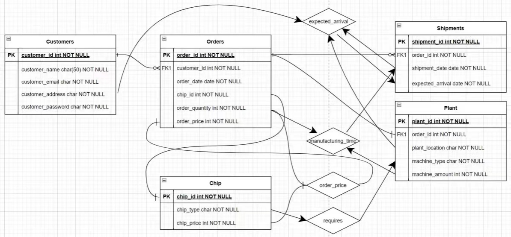

# Visual_database_management
Course project: Implementation of a Python-based database, with visual representation through a web-based user interface utilizing Flask and Jinja frameworks.

## Project abstract
In this project, we realize a system where users can place orders and get the corresponding distribution result. The user can choose the requirements using our API provided. The requirement of the package will be sent to our database and distributed to a particular plant. The information in the database changes according to the order. Finally, the feedback is sent back to the website.

## Function point 
The basic function of our project is **An ordering system for Chips with CRUD functionality**

Users will be able to create an order for chips and amend it (update/delete). The corresponding data will be updated in the database and can be read in the webapp.

We also implement additional functionality to calculate the estimated time required for shipment based on the distance of the customer to the chosen plant.

Furthermore, we also implement a user login and signup system with hashed and salted passwords as well as data validity enforcement.

## Schema Design
| Schema       | Attribute                                                                                |
| ------------ | ---------------------------------------------------------------------------------------- |
| **Consumer** | name, id, email, password                                                                |
| Package      | package_id, consumer_id, date, chip_type, chip_amount, consume_time, budget              |
| Plant        | Plant_id, Machine_type, Machine_amount, package_amount_working_on                        |
| Machine      | Machine_id, Machine_type, Machine_current_operation, Machine_current_chip_type, Plant_id |
| Chip         | Chip_type, Chip_price                                                                                |

Based on the attributes we select, we draw a E-R diagram shown below:



Here are explanations of the entity in E-R diagram:

**Customers**: Anyone who wants to have access to our system needs a customer_id as the primary key. Also they need some information like name, email, address and the passport of the account.

**Orders**: Transactions that customers place. It uses order_id as the primary key. To map the order and the corresponding customer, we use customer_id as the foreign key. Orders also have information like order_date, chip_id, order_quality and order_price.

**Shipments**: Transportation that an order needs. It has shipment_id as the primary key and order_id as the foreign key.  It indicates the shipment date and the expected arrival date.

**Plant**: It holds one to many machines and these machines are of the same type. It uses plant_id as the primary key and order_id as the foreign key. 

**Chip**: An actual integrated circuit to be produced. It uses chip_id as the primary key. Also it has chip_type and chip_price.

## Implementation

### Front-end

For the front-end, we used Jinja2 and Bootstrap for template rendering and the premade layouts (navbar) respectively. Templating saves us the time needed to design the page by allowing us to use pre-defined UI blocks for the application web interface. We use the Flask microframework along with the extensions defined in requirements.txt to provide the functionality of the application, such as interfacing with the SQL Database (SQLAlchemy) and Login forms (flask_login).

### Back-end

Firstly, based on the E-R diagram we designed before, we uses different class in Python to define the Customers, Orders, Shipments, Plants and Chip. Details can be seen in "models.py". Then we can use it as template to design the functions by adding/deleting items in the database. We also design authentication functions to help the users to register or sign in.

### Connection

The SQLAlchemy extension for Flask is used to combine the front and back end. Flask accepts and detects user input and input type. After receiving input, we invoke related methods on the back end according to the user input. For example, after the user selects the query item and clicks the submit button, it will jump to the result output web page. Currently, the methods that the back-end can call are querying data by type and inserting new data.

## How to run

### 1. Clone the repository

```
git clone https://github.com/CSC3170-2022Fall/project-team6
```

### 2. Go into working directory

```
cd working
```

### 3. Install required dependencies
```
pip install -r requirements.txt
```

### 4. Create a database named 'flaskapp' in MySQL
The web app will create the required tables and prepopulate the needed data for operation, but you will need to first create a database named 'flaskapp' in MySQL that is accessible by root.

By default, the ORM is configured to access the MySQL database using the user 'root' with password 'root. You can change this in config.py in the DATABASE_URI. The format is username:password.

### 5. Start the Flask development server
```
flask run
```
### 6. Open the site in your browser at [127.0.0.1:5000](127.0.0.1:5000)

### 7. Sign up for an account and you will be logged in automatically


## Presentation Video

 Here is the presentation video link:

 https://www.bilibili.com/video/BV14e4y1j74i/?vd_source=8ccc6d07a3633ab870ba76f1d9bc0a37